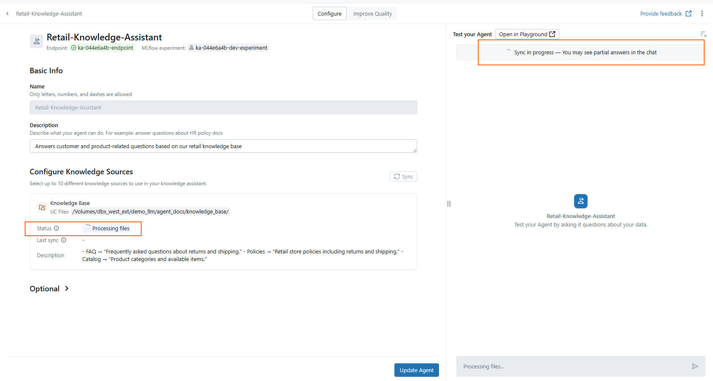
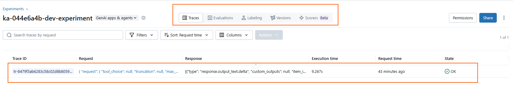
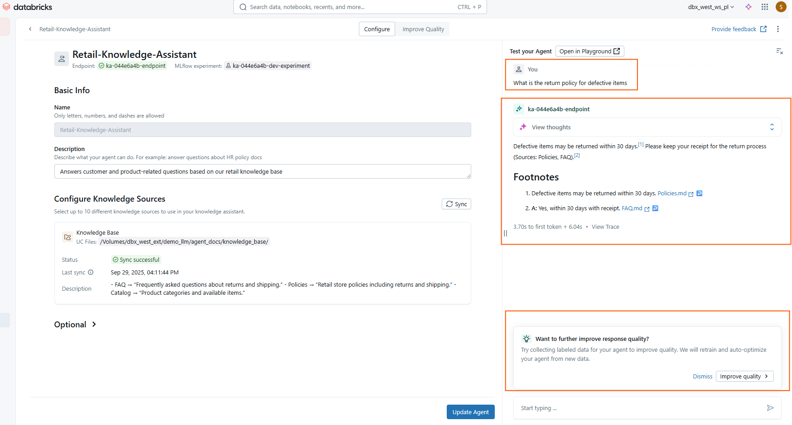

# Agent Bricks – Knowledge Assistant (UI Walkthrough)

## What is a Knowledge Assistant?
A Knowledge Assistant lets you build a **Q&A agent** that answers questions from your own documents.  
It uses Retrieval-Augmented Generation (RAG) with files in Unity Catalog Volumes, ensuring answers are grounded with **citations**.

---

## Step-by-Step Setup

1. Open **AI/ML Experience → Agents → Knowledge Assistant**.
2. Click **Build** → name it `Retail-Knowledge-Assistant`.

---

3. **Basic Info**
   - **Name**: `Retail-Knowledge-Assistant`
   - **Description**:  
     > "Answers customer and product-related questions based on our retail knowledge base."

4. **Configure Knowledge Sources**
   - Click **Add** and configure each source:
     - **Type**: `UC Files`
     - **Source**:  
       - `/Volumes/<your_catalog>/<your_schema>/folder/`
     - **Name**: `Knowledge Base`
     - **Describe the content**:  
       - FAQ → “Frequently asked questions about returns and shipping.”  
       - Policies → “Retail store policies including returns and shipping.”  
       - Catalog → “Product categories and available items.”

   👉 You can add up to 10 sources. For this demo, we’ll use 3.
   👉 The wizard works at **folder level**, so all supported files (`FAQ.md`, `Policies.md`, `Catalog.md`) will be ingested automatically.

6. **Optional – Instructions**
   - Provide guardrails for responses. Example:  
     > “Answer concisely in plain English. Always cite sources. If unsure, respond with ‘I don’t know’.”

7. **Create Agent**
   - Click **Create Agent** to finalize.
   - The system begins processing files (chunking, embedding, indexing).  
   - Status will show **Processing files** until ingestion completes.
  

---

### Processing Phase
After you click **Create Agent**, the assistant begins processing your knowledge base:
- Status will show **Processing files**.
- Behind the scenes, the docs are split into chunks, embedded, and indexed.
- The agent is linked to an MLflow experiment for tracking.

👉 Wait until processing completes (15 min approx) before running serious queries.  
You *can* test while it’s processing, but answers may be partial.

---

## 🔍 MLflow Experiment Link
When your agent is created, Databricks automatically registers an **MLflow experiment** linked to it.  

- Think of it as the **logbook of your agent**:
  - Tracks configuration (knowledge sources, instructions).  
  - Logs queries and responses (for debugging and replay).  
  - Enables evaluations like **faithfulness** (is the answer grounded?) and **citation accuracy**.  

- In the UI, you’ll see:
  - Experiment name like `ka-<id>-dev-experiment`.  
  - Tabs for **Traces**, **Evaluations**, **Labeling**, **Versions**, **Scorers (Beta)**.  

👉 For the workshop, we won’t go deep into MLflow, but it’s useful to highlight that MLflow adds **observability** and **quality control** for agents in production.

---

## Test Prompts
- “What is the return policy for defective items?”  
- “Which product categories do we sell?”  
- “Summarize the shipping policy in 3 bullets.”  

👉 Answers will be grounded in your `.md` docs and include citations.

--- 

