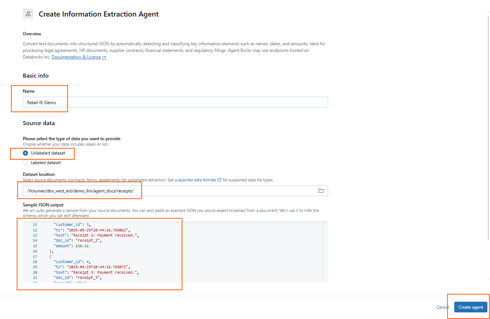
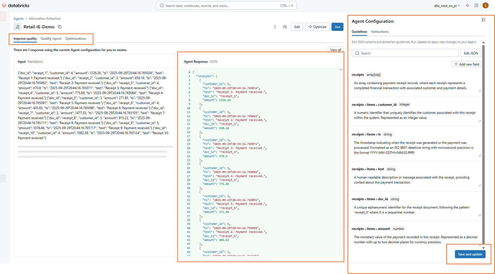
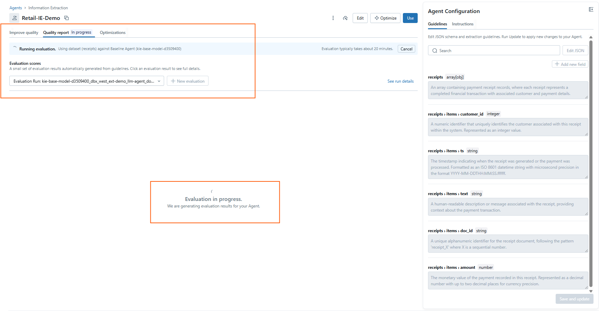
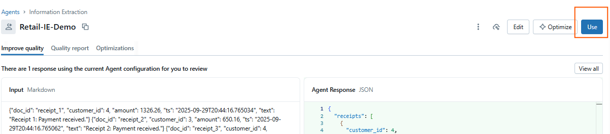
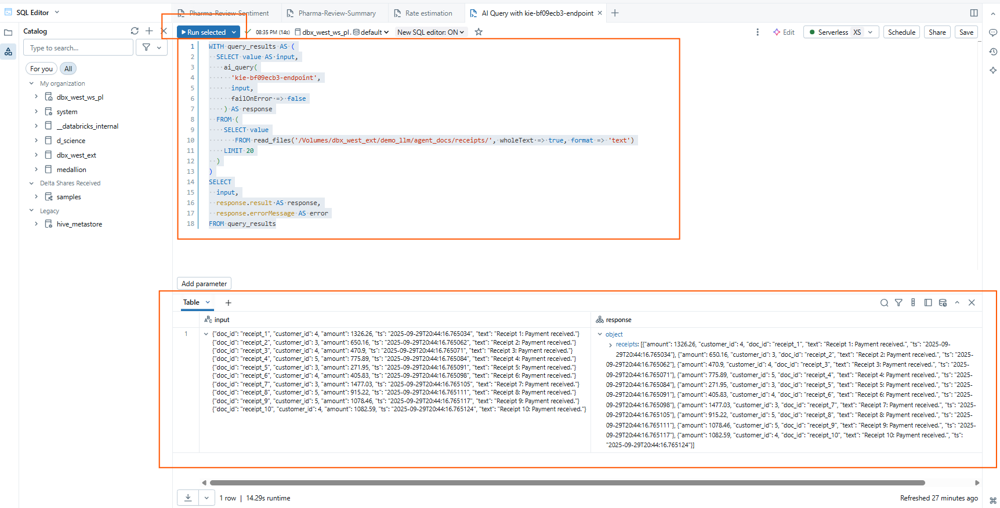

# 03 – Information Extraction (UI Walkthrough)

This pattern turns **unstructured documents** (contracts, receipts, notes) into a **structured Delta table**.  
It automates repetitive tasks like manual data entry.

---

## Why it matters

- **Automation:** Extract fields like amounts, dates, or IDs from documents without coding.  
- **Consistency:** Define a schema once, apply it across thousands of files.  
- **Integration:** Results are written as Delta tables in Unity Catalog, ready for analytics or ML.  
- **Evaluation:** Built-in support for MLflow and Agent Evaluation enables continuous improvement.

---

## Choosing between *Unlabeled* vs *Labeled* dataset

When creating an Information Extraction agent, you have two options:

- **Unlabeled dataset (simpler, faster):**
  - You point directly to files in a UC Volume (JSONL, TXT, PDF, DOCX, etc.).
  - The model learns to extract fields directly from the raw documents.
  - Great for quick demos and prototyping (what we’ll use in this workshop).

- **Labeled dataset (more control, better accuracy):**
  - Requires a Delta table with at least two columns:
    - `input_text` (the raw text to process)
    - `expected_output` (the JSON structure you expect).
  - Useful for production or when you want fine-tuned, consistent extraction quality.

👉 For this workshop we will continue with **Unlabeled dataset** to keep it lightweight, but remember that **Labeled dataset** is the recommended option for enterprise use cases.
 

---

## Steps

1. Open **Agent Bricks → Information Extraction**.  
2. Click **Build** → name the agent, e.g. `Retail-IE-Demo`.

   

   ---

4. Under **Source data**, select **Unlabeled dataset**.  

5. Browse and select one of the JSONL files generated by the asset generator script:
     
    `/Volumes/<your_catalog>/<your_schema>/agent_docs/receipts/`  

    
   > Supported formats: JSON, JSONL, TXT, MD, XML, DOC/DOCX, PDF (PDFs must first be converted into a Unity Catalog table).
   
   > ⚠️ Note: In production you’d typically point to a folder of many documents or use a **labeled dataset** for higher accuracy.
   
   > For this workshop demo we’re keeping it simple with one file.


The wizard will automatically parse the file and display a **sample JSON output**.  
From this sample, the system infers the schema (e.g., `customer_id`, `ts`, `text`, `doc_id`, `amount`).  

5. Review the inferred schema and adjust if necessary.  
For example:  
- `doc_id: string`  
- `customer_id: int`  
- `amount: double`  
- `ts: timestamp`    

6. Click **Create Agent**.



---

## Schema Configuration & Guidelines (after Create Agent)

Once the agent is created, you will see the **Agent Configuration screen**:

- **Input / Response panel (left):** shows raw input and the JSON the agent produced.  
- **Agent Configuration panel (right):** lets you refine the schema by editing:  
- **Field names** (e.g., `customer_id`, `doc_id`)  
- **Data types** (`integer`, `string`, `double`, `timestamp`)  
- **Descriptions / guidelines** → natural language hints that help the model stay consistent.  
 - Example: `customer_id: integer → "Unique identifier of the customer who made the purchase"`  
 - Example: `amount: double → "Payment amount recorded in this receipt in USD"`
- **Instructions (global rules)** → apply formatting or consistency requirements across all extracted elements.  
  - Example: *“All timestamps must be ISO 8601”*  
  - Example: *“Round monetary values to two decimals”*  
  - Example: *“Return `null` if a field is missing, do not infer values”*   

👉 Think of this step as documenting your schema for both **humans** and the **agent**.

6. When finished refining, click **Save and update**.  
This applies your schema and ensures all future extractions follow these rules.  



---

## Quality Report & Evaluation

After saving and updating your agent, you can evaluate its extraction quality.

1. Go to the **Quality report** tab.  
2. Click **+ New evaluation** to start an evaluation run.  
   - Select the dataset (e.g., `/Volumes/main/demo_llm/agent_docs/receipts/receipts.jsonl`).  
   - The run will compare your agent against a baseline model (e.g., `kie-base-model`).  

3. The **Evaluation in progress** message will appear. Results usually take ~20 minutes.  
4. Once complete, the **Evaluation scores** will show how well the agent’s extracted fields match the expected schema.

👉 **Why this matters**:  
- Evaluations help validate your schema design.  
- You can rerun evaluations after refining field descriptions or schema guidelines to measure improvements.

  

---

## Using the Information Extraction Agent

Once your Information Extraction agent is deployed, you can query it directly with SQL:  

After the agent is created and configured, click **Use**.  

  

 ---
 
This will redirect you to the **SQL/AI Query editor**, where the agent can now be invoked programmatically using the prebuild Databricks function `ai_query`

---

### Example: Querying Receipts

```sql
WITH query_results AS (
  SELECT value AS input,
         ai_query(
           "kie-<your-endpoint-id>",   -- Agent endpoint ID
           input,
           failOnError => false
         ) AS response
  FROM (
    SELECT value
    FROM read_files(
      '/Volumes/<your_catalog>/<your_schema>agent_docs/receipts/',
      wholeText => true,
      format => 'text'
    )
    LIMIT 20
  )
)
SELECT input,
       response.result AS response,
       response.errorMessage AS error
FROM query_results;

```

  

---

# 🔎 Real-World Applications & Next Steps

Once the **Information Extraction Agent** is created and tested with `ai_query`, the results are more than just JSON responses — they become **actionable structured data**.  

This bridges the gap between **raw documents** (receipts, contracts, invoices) and **business-ready analytics**.

---

## 🌍 Real-World Applications

### Finance & Accounting
- Automate processing of **invoices and receipts**.  
- Extract fields like `invoice_id`, `amount`, and `due_date` directly into Delta tables.  
- Reconcile transactions automatically with ERP/Finance systems.

### Retail & Customer Insights
- Capture data from **store receipts** (customer ID, purchase amount).  
- Enrich with loyalty program data to analyze **spend patterns** and detect anomalies.  

### Legal & Compliance
- Process **contracts and agreements**.  
- Extract `contract_value`, `expiration_date`, `term_months` → use Delta tables to monitor renewals.  

### Healthcare
- Extract structured information from **claims and medical reports**.  
- Enable faster **billing validation** and operational efficiency.  

### Government & Public Sector
- Digitize and structure **permits, forms, or tax filings**.  
- Make them queryable for compliance, transparency, and auditing.

---

## ⚡ Why use `ai_query` in SQL?

- **Direct Integration** → Analysts can query extracted fields with SQL (no coding).  
- **Composable** → Join results with existing fact/dimension tables for reporting.  
- **Operationalization** → Run on schedules or workflows to process new documents continuously.  

---

## ✅ Next Steps

- **Join with business data** (e.g., receipts with `dim_customer` for customer-level spend).  
- **Feed into dashboards** (Power BI, Databricks SQL dashboards).  
- **Use as ML input** → Extracted fields can train fraud detection or forecasting models.  
- **Add governance** with Unity Catalog to control access and lineage for sensitive fields.  

---

👉 **In short:** This is not just a demo — it shows how **unstructured business documents** can be transformed into **auditable, queryable datasets** that power analytics, automation, and compliance.  

