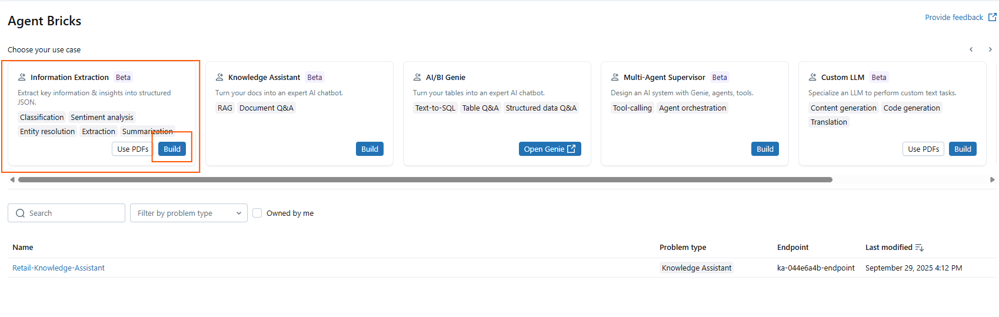

# 03 – Information Extraction (UI Walkthrough)

This pattern turns **unstructured documents** (contracts, receipts, notes) into a **structured Delta table**.  
It automates repetitive tasks like manual data entry.

---

## Why it matters

- **Automation:** Extract fields like amounts, dates, or IDs from documents without coding.  
- **Consistency:** Define a schema once, apply it across thousands of files.  
- **Integration:** Results are written as Delta tables in Unity Catalog, ready for analytics or ML.  
- **Evaluation:** Built-in support for MLflow and Agent Evaluation enables continuous improvement.

---

## Choosing between *Unlabeled* vs *Labeled* dataset

When creating an Information Extraction agent, you have two options:

- **Unlabeled dataset (simpler, faster):**
  - You point directly to files in a UC Volume (JSONL, TXT, PDF, DOCX, etc.).
  - The model learns to extract fields directly from the raw documents.
  - Great for quick demos and prototyping (what we’ll use in this workshop).

- **Labeled dataset (more control, better accuracy):**
  - Requires a Delta table with at least two columns:
    - `input_text` (the raw text to process)
    - `expected_output` (the JSON structure you expect).
  - Useful for production or when you want fine-tuned, consistent extraction quality.

👉 For this workshop we will continue with **Unlabeled dataset** to keep it lightweight, but remember that **Labeled dataset** is the recommended option for enterprise use cases.

---

## Steps

1. Open **Agent Bricks → Information Extraction**.  
2. Click **Build** → name the agent, e.g. `Retail-IE-Demo`.

   

   ---

4. Under **Source data**, select **Unlabeled dataset**.  

5. Browse and select one of the JSONL files generated by the asset generator script:
     
    `/Volumes/<your_catalog>/<your_schema>/agent_docs/receipts/`  

    
   > Supported formats: JSON, JSONL, TXT, MD, XML, DOC/DOCX, PDF (PDFs must first be converted into a Unity Catalog table).
   
   > ⚠️ Note: In production you’d typically point to a folder of many documents or use a **labeled dataset** for higher accuracy.
   
   > For this workshop demo we’re keeping it simple with one file.


The wizard will automatically parse the file and display a **sample JSON output**.  
From this sample, the system infers the schema (e.g., `customer_id`, `ts`, `text`, `doc_id`, `amount`).  

5. Review the inferred schema and adjust if necessary.  
For example:  
- `doc_id: string`  
- `customer_id: int`  
- `amount: double`  
- `ts: timestamp`    

6. Click **Create Agent**.


---

## Expected outcome

- A **structured Delta table** with extracted fields.  
- Each row includes a reference back to the original unstructured doc in the UC Volume.  
- Ready to query with SQL, join with other tables, or feed into ML pipelines.  

---

## Programmatic Query with `ai_query`

Once your Information Extraction agent is deployed, you can query it directly with SQL:  

```sql
-- Query the extraction agent programmatically
SELECT *
FROM ai_query(
  "Retail-IE-Demo",   -- name of your extraction agent
  "Extract contract_value, customer_id, and term_months from the uploaded contracts"
);


