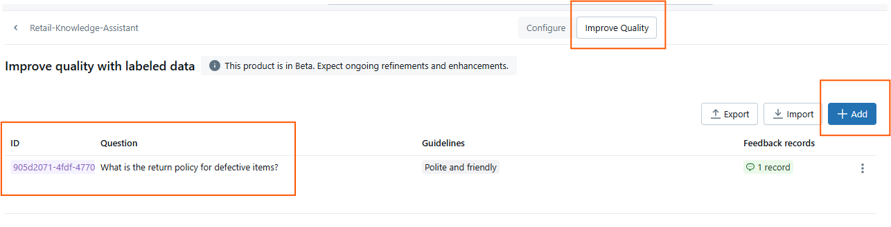
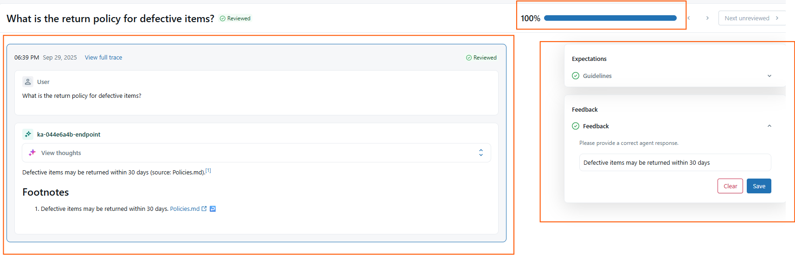
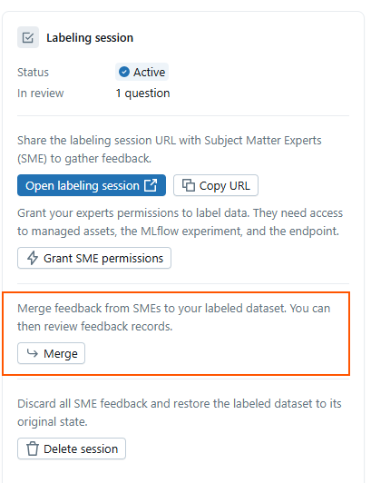

# 04 – Improve Quality & Evaluation

Once your Knowledge Assistant agent is created and you’ve tested some prompts, the next step is to **systematically improve quality**.  
Databricks Agent Bricks provides an *Improve Quality* module that lets you build a labeled dataset for evaluation and continuous refinement.

---

## Why Improve Quality?

- **Reliability:** Ensure the agent consistently provides correct answers.  
- **Transparency:** Track how the agent performed against a “golden dataset.”  
- **Collaboration:** SMEs can review answers through labeling sessions.  
- **Lifecycle:** Labeled examples integrate directly with MLflow for experiment tracking.  

---

## 1. Add Questions

1. Navigate to your Agent → **Improve Quality** tab.  
2. Click **➕ Add**.  
3. Enter a natural language **question**.  
   - Example: *“What is the return policy for defective items?”*  

👉 At this stage you only provide the **question**. The agent will answer it during evaluation.

---

## 2. Feedback & Labeling

Once a question is added, the system:  
- Runs the agent against it,  
- Displays the answer,  
- Lets you or a reviewer give **feedback**.  

Feedback options include:  
- Mark the answer as **Correct**, **Partially correct**, or **Incorrect**.  
- Add **Guidelines** (optional notes about how to interpret or evaluate the answer).  
- Review **Feedback records** to see how the agent performed over time.

---

## 3. Labeling Sessions

You can start a **labeling session** to involve subject matter experts (SMEs):  

- SMEs review the agent’s answers against the questions you added.  
- They provide structured feedback (labels + comments).  
- After review, feedback can be merged into the labeled dataset.  

This enables collaborative and scalable evaluation.  

⚠️ **Permissions required for labeling sessions**:  
- `CAN QUERY` on the endpoint,  
- `EDIT` on the MLflow experiment,  
- `USE CATALOG`, `USE SCHEMA`, `SELECT` on the schema.  

---

## 4. Other Options in *Improve Quality*

Besides manual questions and labeling sessions, you can also:  

- **Import**: Bring in questions from a Unity Catalog table.  
- **Export**: Save labeled examples back to Unity Catalog for analysis.  
- **Expert Feedback**: Use the built-in workflow for SMEs to validate model answers.  
- **View thoughts**: During sessions, reviewers can inspect the agent’s reasoning trace for each answer.

---

## 5. MLflow Integration

Every Knowledge Assistant agent automatically creates an **MLflow experiment**.  
- All labeled examples and feedback are logged here.  
- You can evaluate metrics across runs, compare versions, and track improvement over time.  
- This creates a **closed loop**: Add questions → Label → Evaluate → Improve.  

---

## 6. Notes & Limitations

- **File size:** Knowledge Assistant skips any file over **50 MB** during ingestion.  
- **Knowledge sources:** You can connect either **UC Files** (volumes, directories) or a **Vector Search index**  
  - Vector search requires the `databricks-gte-large-en` embedding model.  
- Processing must complete before evaluations are reliable — the status will update once indexing is finished.  

---

✅ At this point, you have:  
- A working Knowledge Assistant agent.  
- A set of **questions and feedback records** to systematically track quality.  
- The ability to involve experts and close the evaluation loop with MLflow.

