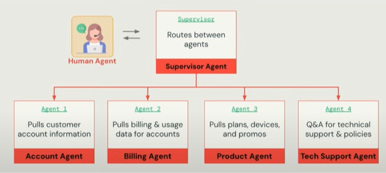

# 05 - Multi-Agent Supervisor (UI Walkthrough)

> Multi-Agent Supervisor lets you orchestrate multiple agents and tools (e.g., **Genie Spaces**, **Agent Bricks agents**, and external tools) under a single “supervisor” that coordinates tasks and synthesizes results. 

---

## What you’ll build

A **supervisor agent** that can:
- Delegate to a **Knowledge Assistant** for RAG-style answers.
- Delegate to an **Information Extraction** agent to produce structured JSON from documents. 
- Optionally query a **Genie Space** for data exploration (text-to-SQL) and combine results. 

> This pattern is ideal when tasks span multiple specialties (search, extraction, analytics) and need a single entry point.

---

## Prerequisites

- Unity Catalog enabled and basic workspace permissions to create Agent Bricks resources. 
- At least one **Knowledge Assistant** (pointing to a UC Volume or Vector Search) and/or **Information Extraction** agent ready. 
- (Optional) An existing **Genie Space** with access to demo tables for ad-hoc questions.

---

## Process at a glance




---

## Step-by-step (Wizard)


In this optional section, we bring all pieces together using a **Multi-Agent Supervisor**.  
The supervisor orchestrates multiple agents:

- **Knowledge Assistant** → answers questions from Markdown docs.  
- **Information Extraction Agent** → extracts structured JSON from receipts/contracts.  
- **Genie (Databricks SQL Agent)** → queries structured datasets in Unity Catalog.  

---

## Why Genie?

To make the demo realistic, we connect Genie to structured **retail datasets**.  
This allows us to ask questions like:

- “Top 5 customers by spend in the last 30 days”  
- “Revenue by product category”  
- “Orders per customer in March”  

These insights complement the **Knowledge Assistant** (docs) and **IE Agent** (raw text → JSON).  

---

## Step 1 — Create Genie Demo Datasets

We’ll generate three Delta tables in Unity Catalog: `customers`, `products`, `orders`.

```python
from pyspark.sql import Row
import random, datetime

catalog = "<your_catalog>"
schema = "your_schema"

# --- Customers ---
customers = [
    Row(customer_id=i, name=f"Customer {i}", country=random.choice(["US", "MX", "CA", "UK"]))
    for i in range(1, 11)
]
spark.createDataFrame(customers).write.mode("overwrite").saveAsTable(f"{catalog}.{schema}.customers")

# --- Products ---
products = [
    Row(product_id=i, category=random.choice(["Electronics", "Clothing", "Books"]),
        name=f"Product {i}", price=round(random.uniform(10, 500), 2))
    for i in range(1, 21)
]
spark.createDataFrame(products).write.mode("overwrite").saveAsTable(f"{catalog}.{schema}.products")

# --- Orders ---
orders = []
start_date = datetime.date(2025, 1, 1)
for i in range(1, 51):
    order_date = start_date + datetime.timedelta(days=random.randint(0, 90))
    orders.append(Row(
        order_id=i,
        customer_id=random.randint(1, 10),
        product_id=random.randint(1, 20),
        quantity=random.randint(1, 5),
        order_date=order_date.isoformat(),
        status=random.choice(["Pending", "Shipped", "Delivered", "Cancelled"])
    ))
spark.createDataFrame(orders).write.mode("overwrite").saveAsTable(f"{catalog}.{schema}.orders")

print("✅ Genie demo tables created: customers, products, orders")

```


---

## Step 2 — Connect Genie to your tables

- Open the Genie UI.
- Create a new Space and select the three demo tables:
   - `customers`
   - `products`
   - `orders`
   - 


👉 Now Genie can answer SQL-based questions over these datasets.
---

### Step 3 Create the Multi Agent Supervisor

1. Open **Agent Bricks → Multi-Agent Supervisor → Build**.  
2. Name it, e.g., `retail-multi-agent-demo`.


---

3. Add the following participants:
   - **Knowledge Assistant** - your RAG bot over UC files/Vector Search  (from section 02)
   - **Information Extraction Agent** - your structured-output extractor (from section 03)
   - **Genie Space** - text-to-SQL over Unity Catalog (connected to your demo tables)

4. (Optional) Add **tools** supported in your workspace (e.g., data/HTTP tools where available).  
   *(Databricks positions Multi-Agent Supervisor to orchestrate agents and tools; some orgs pair this with tool ecosystems.)*

5. Save the configuration.

> Multi-Agent Supervisor is designed to **coordinate** Genie Spaces, Agent Bricks endpoints, and tools. 


---


### 3) Define Supervisor Guidelines (Routing & Roles)
Use natural-language instructions that explain:
- **When to use each participant**  
  - “If the query asks about documents, prefer the **Knowledge Assistant**.”  
  - “If the user requests structured fields (amount, date, customer_id), delegate to **Information Extraction** and return JSON.”  
  - “If the user wants KPIs or aggregations from warehouse tables, consult the **Genie Space**.”
- **How to synthesize** the final answer (cite sources from KA, attach JSON from IE, summarize from Genie SQL results).
- **Stop conditions** (e.g., once confidence > X or after N hops).


> The supervisor uses AI orchestration patterns to manage **delegation and result synthesis**. Keep guidelines explicit and concise.

---

### 4) Save & Update
Click **Save and update** to persist configuration.  


---

## Test the Supervisor

Use the **Test** panel to run prompts that require delegation:
Try composite prompts like:
  - “List the top 3 customers by total spend (Genie), and extract the payment details from the receipts (IE Agent).”
  - “Summarize product policies (Knowledge Assistant) and revenue by product category (Genie).”


Tips:
- If routing looks wrong, refine the **guidelines** with clearer triggers (keywords, examples).
- Keep sample prompts concise and unambiguous.

---

## Use the Supervisor in SQL (ai_query)

Click **Use** to open the SQL/AI editor. Call your supervisor endpoint by name/ID:

```sql
SELECT
  ai_query(
    "retail-multi-agent-demo",   -- your supervisor name or endpoint ID
    "Summarize our receipt totals by customer, and cite sources if any were used"
  ) AS response;
```

---


## Key Takeaway

With Genie, Knowledge Assistant, and Information Extraction combined, the Supervisor Agent can:
- Answer natural language questions from documents.
- Extract structured insights from unstructured text.
- Run SQL analytics over structured data.

This demonstrates the power of multi-agent orchestration in Databricks.

