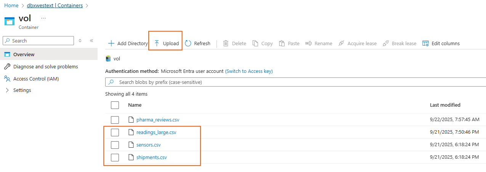

# 02 – Databricks Prep (Dummy Data & Streaming Simulation)

This section prepares the Databricks environment with **dummy tables** that Genie can query.  
We will create a few base tables and simulate **real-time updates** to mimic a production-like workload.

**Note:** You can skip this section if you prefer working with your existing tables in Databricks or you can leverage the built-in delta share `samples` that contains multiple existing datasets in Databricks

---

# Ficticious Scenario

💊 **Pharma-Cold Chain Monitoring**

Pharma companies care deeply about cold chain integrity – vaccines, biologics, and temperature-sensitive drugs must stay in 2–8 °C at all times.
This Genie demo can simulate a real-time monitoring system:

**Tables:**

SHIPMENTS (`SHIPMENT_ID, PRODUCT, ROUTE, ORIGIN, DESTINATION`) - list of pharma shipments with route/origin/destination

SENSORS (`SENSOR_ID, SHIPMENT_ID, POSITION`) - sensors for each shipment (front/middle/back of truck)

READINGS (`READING_TS, SENSOR_ID, TEMPERATURE, HUMIDITY, GPS_LAT, GPS_LON`) temperature/humidity readings every x/min per sensor, with random anomalies (5–10% above 8 °C)

**Business Context:**

“We are monitoring real-time telemetry from refrigerated trucks delivering vaccines across Mexico. If temperature exceeds 8 °C for more than 10 minutes, product might be compromised.”

**Genie Example Questions:**

“Show the shipments that have had an average temperature higher than 8 °C in the last 7 days/24hrs/1hr...”

“Plot the temperature trend of shipment 12345”

“Which routes show the highest number of alerts in the last week?”

## 🛠️ Step 1 – Upload sample files into a Databricks Volume
In order to create the neccesary tables for this workshop we need to upload the csv files contained in this repo `/dbx-genie-teams/files` into our Databricks environment. For this exercise we will leverage [Databricks Volumes](https://learn.microsoft.com/en-us/azure/databricks/sql/language-manual/sql-ref-volumes) that are logical volumes of storage pointing to a cloud storage location where we can store and access files in any format. For more details on how to work with volumnes check the Databricks docs.

---
## 🛠️ Step 2 – Create a dedicated volume storage location in ADLS Gen2 for our files
For storing our files we leverage an existing ADLS Gen2 account who serve as a container for Databricks external objects. In this storage account we are creating a container `vol` who is going to act as the physical location for the logical volume.

Let's create a new folder and upload the csv files accordingly




**Important**

Before we can create tables backed by physical storage, we first need to make sure Databricks has access to the underlying cloud storage. This is done through two key constructs in Unity Catalog: **credentials and external locations**.

🔑[Storage Credential](https://learn.microsoft.com/en-us/azure/databricks/connect/unity-catalog/cloud-storage/storage-credentials) → Think of it as a badge. It defines how Databricks authenticates to cloud storage (for example, using a managed identity).

📂[External Location](https://learn.microsoft.com/en-us/azure/databricks/connect/unity-catalog/cloud-storage/external-locations) → Think of it as the door. It represents a specific storage path (like a container or folder) that can be opened using that badge.

**Unity Catalog** then manages these mappings centrally, so you always know which badges open which doors and who is allowed to use them.


✅ In short: Credentials give Databricks the right to access storage, external locations specify exactly where, and Unity Catalog governs the relationship. For more information, please visit the Databricks docs.

You can manage these constructs in the Databricks Workspace (Catalog Explorer). For example in order to provide access to the `vol` container from Databricks we have created an `external location` name `volumes` who is also mapped to a `storage credential` named `dbx_west_ws_pl` that provide access to these ADLS cloud storage locations.


---
## 🛠️ Step 3 – Create Base Tables

Now that we have our physical storage in place is time to create our logical volume and tables backed by the data in ADLS.

Open/create a **Databricks Notebook** (PySpark & SparkSQL) and run the following code in order:

**Note** You can use the default/existing catalog or create another one. In this case we are using an existing catalog named `dbx_west_ext`. Also, **replace** the placeholders with your storage values.

- Create a schema named `pharma_coldchain` in the target catalog `dbx_west_ext`

```sql
  %sql
-- Create schema 
USE CATALOG dbx_west_ext;
CREATE SCHEMA IF NOT EXISTS pharma_coldchain
COMMENT 'Coldchain monitoring';

```
- Create an external volume named `vol` within the `<catalog>.<schema>` backed by one of our external locations

```sql
%sql
CREATE EXTERNAL VOLUME dbx_west_ext.pharma_coldchain.vol
LOCATION 'abfss://<containername>@<storageaccountname>.dfs.core.windows.net/';

```

- Now with these logical objects created in our catalog let's create our logical tables and populate them with the content from the csv files in the external volume (that points to the external location with csv files). Make sure you provide the filepath for your csv file. This can be obtained by clicking on each file --> `Copy volume file path` within the volume


---

- Create shipments table

```python
# Shipments table

from pyspark.sql.types import StructType, StructField, IntegerType, StringType

# 1. Define an explicit schema
shipment_schema = StructType([
    StructField("SHIPMENT_ID", IntegerType(), True),
    StructField("PRODUCT", StringType(), True),
    StructField("ROUTE", StringType(), True),
    StructField("ORIGIN", StringType(), True),
    StructField("DESTINATION", StringType(), True)
])

# 2. Read CSV with the schema definition 
df = (spark.read
      .format("csv")
      .option("header", "true")
      .schema(shipment_schema)
      .load("/Volumes/<catalog>/<schema>/<volume_name>/shipments.csv"))  #replace with your volume path

#display(df)

# Create the delta table
(df.write
   .format("delta")
   .mode("overwrite") # replace if exists
   .saveAsTable("pharma_coldchain.shipments"))

```

---

- Create sensors table

```python
#Sensors table

from pyspark.sql.types import StructType, StructField, IntegerType, StringType

# 1. Define sensor schema
sensors_schema = StructType([
    StructField("SENSOR_ID", IntegerType(), True),
    StructField("SHIPMENT_ID", IntegerType(), True),
    StructField("POSITION", StringType(), True)
])

# 2. Read CSV with the schema definition 
df_sensors = (spark.read
              .format("csv")
              .option("header", "true")
              .schema(sensors_schema)
              .load("/Volumes/<catalog>/<schema>/<volume_name>/sensors.csv")) #replace with your volume path

#display(df_sensors)

# 3. Create the delta table
(df_sensors.write
   .format("delta")
   .mode("overwrite")  # replace if exists
   .saveAsTable("pharma_coldchain.sensors"))
```

---

- Create readings table. For this table we will create the table definition only (no data yet) as we will run a Python script later who is going to fill the table in chunks simulating an streaming process in real time, the idea is to execute this script   once we have our Genie Space created so we can start asking questions and Genie will get variances as the table is incrementally populated.

```sql
%sql
-- Readings table (empty to start streaming simulation)
CREATE OR REPLACE TABLE  pharma_coldchain.readings (
  READING_TS TIMESTAMP,
  SENSOR_ID INT,
  TEMPERATURE DOUBLE,
  HUMIDITY DOUBLE,
  GPS_LAT DOUBLE,
  GPS_LON DOUBLE
) USING DELTA;
```

We can validate our objects are created in the Databricks Catalog Explorer


