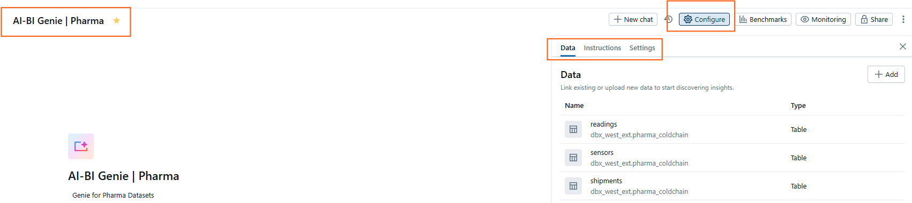

# 03 – Databricks Genie Setup

In this section we configure **Databricks Genie** inside your Databricks workspace.  
This includes enabling the feature, creating a **Genie Space**, and connecting it to your demo tables so it can be used as context.  

---

## 🛠️ Step 1 – Enable Genie in the Workspace

1. Log into your **Databricks Workspace**.  
2. From the left **sidebar**, click on **Genie**.  
   - If you don’t see Genie, ensure your workspace is on a **Premium or Enterprise plan** and that your Workspace admin has **enabled Genie** in `Settings--> Advanced--> Other--> Partner-powered AI assistive features`.  
3. Confirm that your cluster or SQL Warehouse is running (serverless would be easier). Genie requires a compute resource to execute queries.  

---

## 🛠️ Step 2 – Create a Genie Space

A **Genie Space** is a governed container where you configure the datasets, context, and personas that Genie can use to interact with data and provide insights.

1. In the Genie UI, click **+ New**.    
2. Next step is **Connect your data**. Select the **Lakehouse tables** you created earlier in [Section 02](./02-databricks-prep.md):
   
3. Search your `<catalog>`.`<schema>` and select your tables: 
   - `readings`  
   - `sensors`  
   - `shipments`  
4. Click **Create**


5. We can now start configuring some aspects of our Genie Space. For now let's give our Genie Space a new name, in the upper left select/click over the Genie Space default name (i.e New Space) and add the name of your preference
   We will name ours as `AI-BI Genie | Pharma`. We will focus on three settings for this exercise:  `Data`, `Instructions`, `Settings` that are located in the **Configure** menu (upper right side).



---

## 🛠️ Step 3 – Configure Genie Context

**Data**
A Genie Space and its underlying LLM has only access to the data is given access to, in this case here we can see the tables we configured as context during the Genie Space creation but also we can add/remove/search data from Unity Catalog here.
Let's leave our initial tables


**Instructions**
The Instructions section defines how Genie should behave when interacting with your data. It has three complementary parts:

- `Text` → Used to give Genie natural language guidance, such as mapping business terms to tables, defining rules (e.g., temperature thresholds), or specifying response styles (e.g., always reply in Spanish/English). In my case I wanted to test this for     Spanish speaking language so I instructed Genie to reply in Spanish always, you can customize it as needed

 

- `Joins` → Defines the relationships between tables (e.g., shipments → sensors → readings) so Genie knows how to combine data correctly when generating queries.

 

- `SQL Queries` → Provides example query patterns or reusable logic that Genie can follow, ensuring consistency and alignment with business rules when answering questions.

 


---

## 🛠️ Step 4 – Test Genie Queries

Try asking Genie questions directly in the Databricks workspace to validate setup. But to make this more realistic let's execute our streaming script first to start generating data while we ask questions in parallel.

 


- Let's ask some random questions and see the outputs.

```text
"¿Cuál es la tendencia de humedad en las lecturas de los últimos 7 días?"  English ("What is the humidity trend in the readings from the last 7 days?")
"Filtra los embarques con temperatura promedio mayor a 8 °C?"  English ("Filter the shipments with an average temperature greater than 8 °C.?")

 
 

