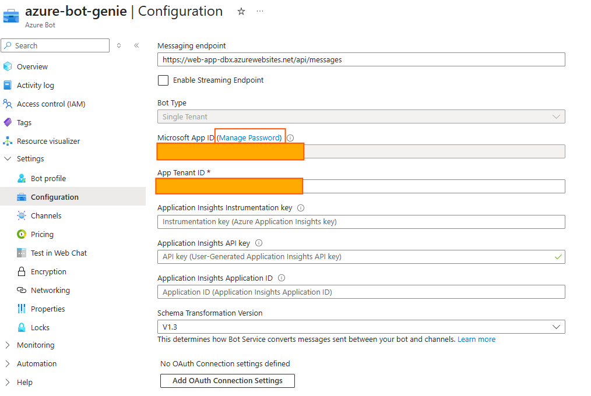

# 04 – App Service & Azure Bot Setup

In this section, we’ll configure the necessary Azure resources for hosting the middleware and connecting the bot to Genie and Teams. 
In summary we need:

- A Resource Group
- An App Service Plan
- A Web App
- An Azure Bot

---

## 4.1 Create Azure Resources

### 4.1.1 Resource Group  
1. Go to the Azure Portal → **Create a resource** → **Resource Group**.  
2. Choose your subscription, region, and resource group name (e.g. `rg-genie-teams`).  
3. All subsequent resources should be created in this same region.


---

### 4.1.2 App Service Plan  
1. Create a resource → search **App Service Plan**.  
2. Configure:
   - Subscription & Resource Group  
   - Name (e.g. `app-service-dbx`)  
   - **Linux** as OS  
   - Region matching the other resources in Resource Group (I chose Canada Central due to quota constraints)
   - Pricing Tier: start with **Basic B1** or anyone available in your subscription (F1 might work too) 
3. Create the plan.


---

### 4.1.3 Web App  
1. Create a resource → **Web App**.  
2. Configure:
   - Subscription & Resource Group  
   - Name (e.g. `web-app-dbxx`)  
   - Publish: **Code**
   - Uncheck `Secure unique default hostname on`
   - Runtime stack: **Python (3.13)**  
   - Region: same region as the App Service Plan
   - Pricing Plan: Choose your newly created App Service Plan
3. Click **Review + create**


   
4. Open the Web App resource and go to the side bar --> **Settings → Configuration**:
5. Add the following configs
   
   - **Startup Command**:  
     ```
     python3 -m aiohttp.web -H 0.0.0.0 -P 8000 app:init_func
     ```
6. Save changes.


   
7. Now go to the side bar --> **Settings → Environment values** and add the following variables:
   
   - **Environment Variables**:
     - `SCM_DO_BUILD_DURING_DEPLOYMENT = True`  (will take care of build/install dependencies during deployment)
     - `WEBSITE_HTTPLOGGING_RETENTION_DAYS = 3` (log retention for 3 days)
     - 
9. Save changes.


---

## 4.2 Create and Configure the Azure Bot

### 4.2.1 Create Azure Bot Resource  
1. Create a resource → **Azure Bot**.  
2. Configure:
   - Bot handle / name (i.e azure-bot-genie)
   - Subscription & Resource Group (attach the existing ones)
   - Data Residency: **Global**  
   - Pricing Plan: **Free** (for dev / POC)  
   - Type of App: **Single Tenant**  
   - Creation type: **Create a new Microsoft App ID**  (it will generate an App Registration)
   - Service Management reference: Leave it blank
  


---

### 4.2.2 Configure Bot Messaging Endpoint  
1. In the new Azure Bot resource go to the side bar → **Configuration** → Messaging Endpoint  
2. Set it to:

   `https://<your-webapp-name>.azurewebsites.net/api/messages`
   
4. Save.



---

### 4.2.3 Copy IDs & Create Secret  
1. Under Bot settings, get:
- **Microsoft App ID**  
- **Tenant ID**  
2. Under **“Manage Password” / “Client secrets”** → generate a **new client secret**  
3. Save (store securely with Genie Space ID, App ID, Tenant ID)


**Note**
Genie Space ID can be found in the Genie UI under. We will need this value 


---

### 4.2.4 Enable Teams Channel  
1. Go to **Channels** in Bot resource  
2. Add **Microsoft Teams**  
3. Accept any Terms of Service  
4. Save changes

---

## 4.3 Deploy the Middleware Application

### 4.3.1 Clone / Prepare the Bot Code  
1. Clone the bot repository (or your own fork).
We will use the code that Luiz Carrossoni Neto wrote — his GitHub repo is here — https://github.com/carrossoni/DatabricksGenieBOT

2. Edit configuration (e.g. `config.py` or `.env`will be better) to include the env variables:
   
- **Microsoft App ID**  
- **Client Secret**  
- **Tenant ID**  
- **Genie Space ID**  
- **Genie API Endpoint**  
- **Databricks Access Token**

**Note**: To get a Databricks token, head to https://adb-<yourhost>.azuredatabricks.net/settings/user/developer and create an Access Token.

3. Save the **config.py** file

### 4.3.2 Azure CLI & Deployment  
1. Install / use **Azure CLI**  
2. Run: `az login` and select the correct subscription  
3. Open **Log Stream** for your Web App (in Azure Portal) to monitor logs during deployment  
4. Deploy the application:

   `az webapp up --name <your-webapp-name> --resource-group <rg-genie-teams> --plan <your-app-service-plan> --runtime "PYTHON:3.13" --sku B1`

5. Monitor deployment status via the Deployment Center in Azure Portal  
6. Confirm the application is running and the bot endpoint is reachable

---

## 4.4 Test the Bot & Teams Integration

1. In the Azure Portal, open your Bot resource → **Test in Web Chat**  
- You should see a greeting like `Welcome to the Databricks Genie Bot!`  
2. In the same Bot resource → **Channels** → **Open in Teams**  
- This will allow you to try the bot inside Teams  
3. Confirm that messages sent in Teams are forwarded via the bot to your backend, and that the backend can call the Genie API and return responses  

---

## 4.5 Summary of Configuration

| Component        | Key Configurations / Values |
|------------------|------------------------------|
| Resource Group   | Region, name                 |
| App Service Plan | Linux OS, pricing tier       |
| Web App          | Runtime (Python), startup command, env vars |
| Azure Bot        | Messaging endpoint, App ID, secret, Teams channel |
| Middleware App   | Configuration: App ID, secret, Genie API, Databricks token |

---

At the end of this section, you will have:
- An Azure Web App hosting your middleware  
- An Azure Bot registered and connected to that Web App  
- The bot added as a Teams channel, ready to accept messages  

Next up (Section 05): connecting the bot logic to Genie & Teams (handling messages, routing queries, etc.).  

