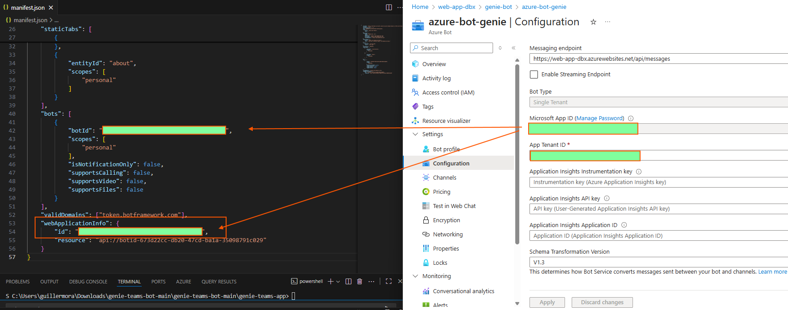

# 05 – Publish the Bot to Microsoft Teams

This guide explains how to package your Azure Bot as a **Teams app**, upload it via **Developer Portal**, and verify it works end-to-end with your Databricks Genie backend. 

---

## 5.1 Requirements (Teams & Tenant)

- A **Microsoft 365 tenant** where we can upload custom apps. We are using a Contoso Tenant (special) for this purpose 
- **Teams custom app upload** must be allowed. Head to **[Teams admin center](https://admin.teams.microsoft.com/)**:  
  `Teams apps → Setup policies → Add a policy → Upload custom apps = On` (we will attach our bot to this policy later)


  
- You can upload apps via **Teams client** (`Apps → Manage your apps → Upload an app → Upload a custom app`) or through **Developer Portal** (“Import app”, “Publish to org”). 


**We’ll need from previous sections**
- **Microsoft App ID** (Azure Bot’s App ID).
- **Messaging endpoint** (your Web App `/api/messages`).
- Optional: **Genie Space ID / endpoint** (already wired in the backend).

---


## 5.2 Create the Teams App Manifest

- For the next step we would now need to create a manifest file, there are multiple ways to create a manifest file, but for this example we will be using 
  Kyle Hale’s manifest, which can be found in his repo here --> https://github.com/kthejoker/genie-teams-bot.git
  Download the `genie-teams-app` folder from the repo, this template targets **Teams** and supports **personal, team, and group chat** scopes.

**Note**

- The folder also contains two files: color.png and outline.png. These are the bot logos and can be replaced with your custom logos. Ensure they retain the same names (color.png and outline.png), or else the changes will not be reflected


- Now in the editor of your choice clone the repo or open the downloaded `genie-teams-app` folder and navigate to the `manifest.json` file inside and replace the values in the keys **bots/botId** and **webApplicationInfo/id** with the Microsoft App ID from your Azure Bot resource




- After modyfying and save the `manifest.json` file we will need to create a new version of the manifest to upload it in Teams. So, open the terminal in your editor and navigate to the `genie-teams-app`folder and run the    following command (for windows users):

  ```
  Compress-Archive -Path * -DestinationPath genie-teams.zip
  
  ```

  A new zip file will be created. Keep this file as we need to upload it into Teams


  
