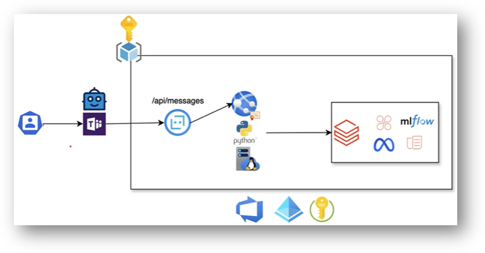

# 📖 Overview of Databricks Genie + Microsoft Teams Integration

## 🔎 What is Databricks Genie?
Databricks Genie is a **natural language interface** for querying and interacting with data inside the Databricks Lakehouse.  
- Instead of writing SQL or Spark code, users can ask questions in plain English (or other languages).  
- Genie translates those queries into optimized SQL code, executes them, and returns the results in real time.  
- It helps democratize analytics by making data accessible to **business users, analysts, and technical teams** without requiring deep coding skills.  

---

## 💡 Why Integrate Genie with Microsoft Teams?
Most organizations already collaborate in **Microsoft Teams** every day. By bringing Genie directly into Teams:  
- **Frictionless access** → Ask questions about your data without switching tools.  
- **Real-time insights** → Get answers on updated data, powered by Databricks.  
- **Collaboration** → Share results and discuss insights with teammates in chat.  
- **Governance & Security** → Leverage Azure AD, Teams policies, and Databricks governance features.  

This integration helps bridge the gap between **data platforms** and **collaboration platforms**, turning Teams into a true hub for decision-making.

---

## 🛠️ What This Repository Covers
This repo provides a **step-by-step, end-to-end implementation** of Genie + Teams integration based on a Pharma escenario, broken into three parts:  

1. **Databricks Prep**  
   - Create and populate dummy tables (e.g., sensors, shipments, readings).  
   - Simulate real-time updates to demonstrate Genie’s query capabilities.  

2. **Genie API Setup**  
   - Create and expose Genie conversation API through a middleware (App Service and Azure Bot) (based on [Ryan Bates’ guide](https://medium.com/@ryan-bates/microsoft-teams-meets-databricks-genie-api-a-complete-setup-guide-81f629ace634)).  
   - Connect Genie’s to downstream apps.  

3. **Azure Bot + Teams Integration**  
   - Build and deploy an Azure Bot connected to Genie API.  
   - Configure App Service, Bot Channels, and Teams App Manifest.  
   - Enable conversational Q&A directly inside Microsoft Teams (based on [Sai Ponugoti’s guide](https://saiponugoti.medium.com/microsoft-teams-databricks-genie-api-end-to-end-integration-2d22b4767e33)).  

---

## 🚀 End-to-End Flow (Architecture)

1. **User in Microsoft Teams**  
   - Initiates a natural language query in Teams.

2. **Azure Bot Service**  
   - Receives the message (`/api/messages`).  
   - Routes it to the backend service hosted on Azure App Service.

3. **Middleware / Backend Service**  
   - Python (or Node.js) app hosted on Azure App Service.  
   - Handles authentication (DBX Token, Azure AD, Key Vault).  
   - Forwards the query to **Databricks Genie API**.

4. **Databricks Genie & Lakehouse**  
   - Genie translates the natural language question into SQL/Spark.  
   - Executes against Lakehouse tables (Delta).  
   - Returns structured results.

5. **Response Back to Teams**  
   - Results are sent from Genie → backend → Azure Bot → Microsoft Teams.  
   - User sees the answer inline in their Teams conversation.
  

---

## 🎯 Who Is This For?
- **Data Engineers & Analysts** → who want to showcase Genie in action.  
- **Solution Architects** → designing integrated data + collaboration solutions.  
- **Business Teams** → who want real-time insights in their collaboration space.  

---

⚡ By the end of this guide, you’ll have a **fully working Teams bot powered by Databricks Genie**, ready to query your Lakehouse data in natural language.

> Continue to **[01. Prerequisites](01-prerequisites.md)**.
